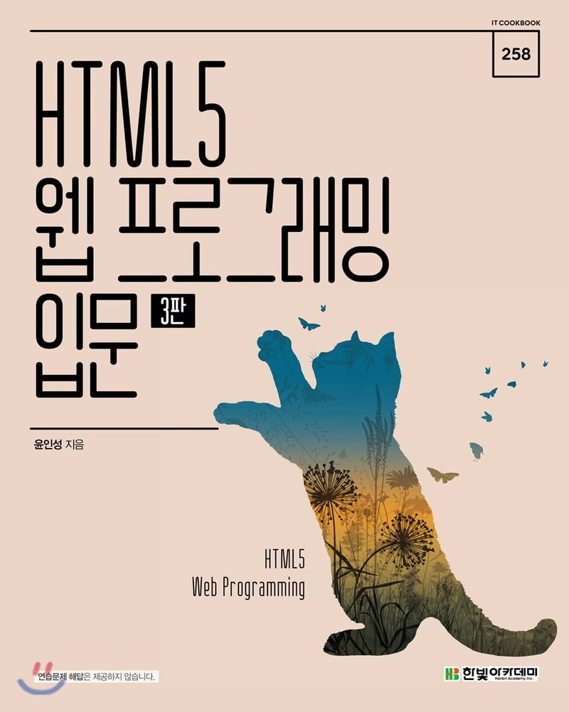

# WEB-Programming-Practice
['HTML5 웹 프로그래밍 입문'](http://www.yes24.com/Product/Goods/76897377) 책의 응용 예제 및 종합 예제를 실습합니다. 

## 목차

Chapter 01 웹 개요와 실습 환경 구축

 - 01 인터넷과 웹 시작
 - 02 웹 브라우저 전쟁과 웹 표준
 - 03 웹 동작
 - 04 웹 표준 기술과 HTML5 주요 기능
	 - 4.1 웹 표준 기술  
	 - 4.2 HTML5 주요 기능
 - 05 HTML5를 공부하면 좋은 이유  
 - 06 실습 환경 구축  
 - 연습문제  

 

Chapter 02 웹 페이지 기본 구조와 작성 방법

 - 01 HTML5 기본 용어  
	- 1.1 태그와 요소  
	- 1.2 속성  
	- 1.3 주석  
 - 02 HTML5 페이지 구조와 작성법  
	- 2.1 HTML5 페이지의 구조  
	- 2.2 HTML5 페이지의 작성과 실행  
	- 2.3 스타일시트 작성과 실행  
	- 2.4 자바스크립트 작성과 실행  
 - 03 오류와 검증  
 - 연습문제  

Chapter 03 HTML5 기본 태그

  
 - 01 글자 태그  
	 - 1.1 제목과 본문 글자 태그  
	 - 1.2 앵커 태그  
	 - 1.3 글자 모양 태그  
 - 02 목록 태그  
 - 03 테이블 태그
 - 04 미디어 태그
 - 연습문제

Chapter 04 HTML5 입력 양식 태그와 구조화 태그

	- 01 입력 양식 태그  
	- 1.1 입력 양식 개요
	 - 1.2 입력 양식 종류
 - 02 HTML5 문서 구조화  
	 - 2.1 공간 분할 태그  
	 - 2.2 시맨틱 태그  
- 연습문제  
- 종합 예제 1 블로그 레이아웃 구성  

Chapter 05 CSS3 기초: 선택자와 단위

  
- 01 선택자의 용도와 사용법  
- 02 기본 선택자  
- 03 속성 선택자  
- 04 후손 선택자와 자손 선택자  
	- 4.1 후손 선택자  
	- 4.2 자손 선택자  
 -05 반응·상태·구조 선택자  
	 - 5.1 반응 선택자  
	- 5.2 상태 선택자  
	 -5.3 구조 선택자  
 -06 CSS3 단위  
	 -6.1 키워드 단위  
	 -6.2 크기 단위  
	 -6.3 색상 단위  
	 -6.4 URL 단위  
 -연습문제  

Chapter 06 CSS3 속성

 
- 01 박스 속성  
	 - 1.1 박스 크기와 여백  
	 - 1.2 박스 테두리  
 - 02 가시 속성  
 - 03 배경 속성  
	 - 3.1 배경 이미지 삽입과 크기 지정  
	 - 3.2 배경 이미지 반복과 부착 형태, 위치  
 - 04 글자 속성  
	 - 4.1 글자 크기와 글꼴  
	 - 4.2 글자의 스타일과 두께  
	 - 4.3 글자 정렬  
	 - 4.4 링크 글자의 밑줄  
 - 05 위치 속성  
	 - 5.1 요소의 고정 위치와 상대 위치 지정  
	 - 5.2 위치 속성 공식  
	 - 5.3 내용이 요소 크기를 벗어날 때 처리  
- 06 유동 속성  
 - 07 그림자와 그레이디언트 속성  
	 - 7.1 그림자 속성  
	 - 7.2 그레이디언트 속성  
 - 연습문제  

Chapter 07 다양한 레이아웃의 구성과 기능

  
- 01 수평, 중앙, One True 정렬 레이아웃  
	 - 1.1 수평 정렬 레이아웃  
	 - 1.2 중앙 정렬 레이아웃  
	 - 1.3 One True 레이아웃  
 - 02 요소 배치  
	 - 2.1 절대 위치를 사용한 요소 배치  
	 - 2.2 요소를 중앙에 배치  
	 - 2.3 요소를 고정 위치에 배치  
 - 03 글자 생략  
 - 연습문제  

  

Chapter 08 반응형 웹

  
- 01 반응형 웹 소개  
- 02 반응형 웹을 위한 설정  
	- 2.1 뷰포트 설정  
	 - 2.2 미디어 쿼리 설정  
 - 03 반응형 웹 패턴  
 - 연습문제  
 - 종합 예제 2 블로그에 스타일시트 적용  

Chapter 09 자바스크립트 기본 문법

  
- 01 자바스크립트 기본 용어와 출력 방법  
	 - 1.1 자바스크립트 기본 용어  
	 - 1.2 자바스크립트 출력  
 - 02 자료형과 변수  
	 - 2.1 자료형  
	 - 2.2 변수  
 - 03 조건문과 반복문  
	- 3.1 조건문  
	 - 3.2 반복문  
- 04 함수  
	- 4.1 선언과 호출, 실행 우선순위  
	 - 4.2 매개변수와 반환 값  
	 - 4.3 콜백 함수  
 - 05 객체  
	 - 5.1 객체 개요  
	 - 5.2 속성과 메서드  
 - 연습문제  

Chapter 10 문서 객체 모델

  
- 01 문서 객체 모델의 기본 용어와 개념  
	- 1.1 문서 객체 모델 기본 용어  
	 - 1.2 웹 페이지 실행 순서   
 - 02 문서 객체 선택  
- 03 문서 객체 조작  
	- 3.1 글자 조작  
	- 3.2 스타일 조작  
	- 3.3 속성 조작  
- 04 이벤트  
	- 4.1 이벤트 연결  
	- 4.2 이벤트 사용  
- 연습문제  

  

Chapter 11 jQuery 라이브러리

  
- 01 jQuery 라이브러리 설정  
- 02 문서 객체 선택  
- 03 문서 객체 조작  
	- 3.1 속성 조작  
	- 3.2 스타일 조작  
	- 3.3 글자 조작  
	- 3.4 클래스 조작  
- 04 이벤트  
	- 4.1 이벤트 연결  
	- 4.2 이벤트 사용  
- 05 시각 효과  
- 연습문제  

  

Chapter 12 자바스크립트와 jQuery 라이브러리 응용

  
- 01 입력 양식 포커스  
- 02 프레임 애니메이션  
- 03 문서 객체 생성과 추가  
- 04 무한 스크롤  
- 05 플러그인 사용  
- 06 갤러리  
- 연습문제  
- 종합 예제 3 블로그에 자바스크립트 적용    

  

Chapter 13 프로젝트: 모바일 페이지 제작

  
- 01 미리 알아볼 내용  
	 - 1.1 동위 선택자  
	- 1.2 동위 선택자를 활용한 풀다운 메뉴  
- 02 프로젝트 소개  
- 03 레이아웃 구성  
- 04 스타일시트 적용  
	- 4.1 초기화  
	- 4.2 공통 구성  
	- 4.3 헤더 구성  
	- 4.4 본문과 푸터 구성  

Chapter 14 프로젝트: 핀터레스트 스타일의 웹 페이지 제작

  
- 01 프로젝트 소개  
- 02 레이아웃 구성  
- 03 스타일시트 적용  
	- 3.1 초기화  
	- 3.2 헤더 구성  
	- 3.3 풀다운 메뉴 구성  
	- 3.4 내비게이션 구성  
	- 3.5 웹 페이지 구성  
	- 3.6 라이트박스 구성  
- 04 자바스크립트 적용  
	- 4.1 풀다운 메뉴 구성  
	- 4.2 페이지 구성  
	- 4.3 라이트박스 구성

